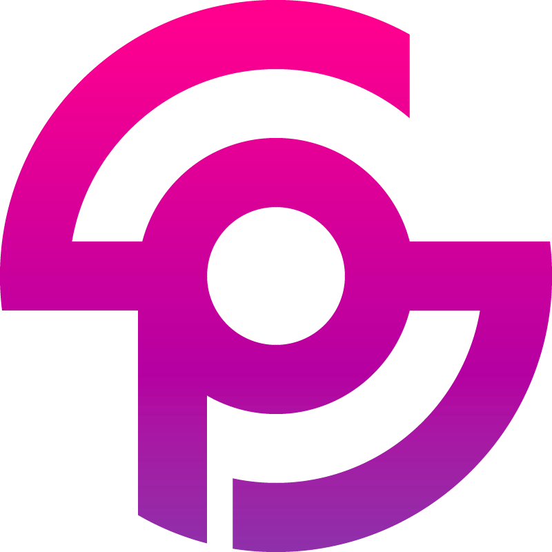

  
   

  <h5 align="center">sexy-portfolio</h5> 
  

  
  

  <h1 align="center">👨‍💻 Best web portfolio for developers 🍾</h1>

This portfolio is made with [React](https://github.com/facebook/react), [Material UI](https://github.com/callemall/material-ui) and a lot of efforts.
Although it is my personal portfolio, feel free to fork and have fun with it.

## Installation

1. Run `yarn`.
2. Run `yarn start`.
3. Visit [localhost:3000](http://localhost:3000).

## Publish on GitHub Pages

1. Run `npm run deploy`. This will start the build process and push afterwards to the gh-pages branch.
2. Set under Settings > GitHub Pages the source to `gh-pages branch` and click `Save`.

  #### This project is still in development. If you wish to contribute to it, fork it and make up a pull request :)

